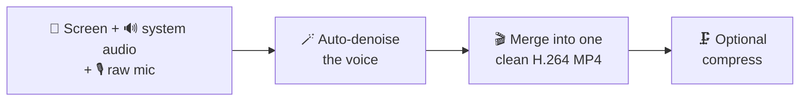

<div align="center">


### Crisp screen, clean voice.

A cross‑platform desktop screen recorder that captures your screen in high resolution with **system audio** and an **isolated microphone track**, then denoises your voice and merges everything into a single clean **H.264 MP4** — all fully offline.

<p>
  <a href="https://github.com/codewithowais/CrispCast/releases/latest"></a>
  <a href="https://github.com/codewithowais/CrispCast/releases"></a>
  <a href="LICENSE"></a>
  
  
</p>

**[⬇️ One‑click download](https://codewithowais.github.io/CrispCast/)** · [Features](#-features) · [How it works](#-how-it-works) · [Build](#-build-from-source) · [Contributing](#-contributing)

</div>

---

## ✨ Features

| | |
|---|---|
| 🎥 **High‑res screen** | Records at the source's **native resolution** (Retina/4K), up to 60 fps. |
| 🔊 **System audio** | Captures the actual computer output (app sound, video playback), not just the mic. |
| 🎙️ **Isolated mic track** | Your voice saved **raw** on its own track — no suppression, gain, or echo cancellation. |
| 🪄 **Auto clean + merge** | Denoises the voice and merges it with system audio into **one H.264/AAC MP4**. |
| 🗜️ **Optional compression** | One click to shrink the final file to **1080p** or **720p** for easy sharing. |
| 🪟 **Pick any window** | Choose a screen or any window — on macOS via Apple's picker (all desktops), on Windows/Linux via an in‑app grid. |
| 📁 **Your save folder** | Pick where recordings go, any time, from the in‑app **Save to → Change…** bar. |
| 🔒 **Fully offline** | All processing runs locally through a bundled `ffmpeg`. No cloud, no account, no model download. |

## ⬇️ Download

**[Get it in one click →](https://codewithowais.github.io/CrispCast/)** (auto‑detects your OS)

Or pick a specific build from the **[Releases page](https://github.com/codewithowais/CrispCast/releases/latest)**:

| Platform | Installer |
|----------|-----------|
| 🍎 macOS (Apple Silicon) | `CrispCast-<ver>-arm64.dmg` |
| 🍎 macOS (Intel) | `CrispCast-<ver>.dmg` |
| 🪟 Windows | `CrispCast-Setup-<ver>.exe` |
| 🐧 Linux | `CrispCast-<ver>.AppImage` / `.deb` |

<details>
<summary><b>First launch — the app is unsigned, so open it like this</b></summary>

Because the builds aren't code‑signed, the OS warns you the first time:

- **macOS** — right‑click (Control‑click) the app → **Open** → confirm. If needed, allow it under System Settings → Privacy & Security → **Open Anyway**. Also grant **Screen Recording** (System Settings → Privacy & Security → Screen Recording) and relaunch.
- **Windows** — on the SmartScreen prompt, click **More info** → **Run anyway**.

</details>

## 🎬 How it works



Recordings save to a folder you choose (default `Movies/CrispCast` on macOS, `Videos/CrispCast` on Windows/Linux). The mic is kept on its own track so it can be cleaned independently, then remuxed back:

| File | Contents |
|------|----------|
| `recording-<time>.webm` | Screen video (native res) + system audio |
| `recording-<time>-voice.webm` | Your microphone, **raw** |
| `recording-<time>-clean.mp4` | Final video with the **denoised voice** mixed in |

The offline denoise chain is a simple ffmpeg filter — cut rumble/hiss/AC noise, then normalize loudness (tune `VOICE_FILTER` in [`main.js`](main.js)):

```
highpass=f=80 · afftdn · anlmdn · loudnorm
```

The raw `.webm` files are always kept, so you can re‑clean with different settings anytime.

## 🖥️ Platform support

| OS | Choose a window | System audio |
|----|-----------------|--------------|
| 🍎 **macOS** 14+ | Native ScreenCaptureKit picker — **all windows, all desktops** | ✅ ScreenCaptureKit loopback |
| 🪟 **Windows** | In‑app grid — all windows | ✅ WASAPI loopback |
| 🐧 **Linux** | In‑app grid — all windows (X11; Wayland via PipeWire portal) | ⚠️ loopback varies by setup |

Full per‑OS details, permissions, and packaging notes: **[CROSS_PLATFORM.md](CROSS_PLATFORM.md)**.

## 🛠️ Build from source

```bash
git clone https://github.com/codewithowais/CrispCast.git
cd CrispCast
npm install
npm start
```

Build installers for the current OS (needs Node ≥ 20):

```bash
npm run dist     # → .dmg / .exe / .AppImage / .deb in dist/
```

Releases are built automatically by GitHub Actions on every `v*` tag — see [RELEASING.md](RELEASING.md).

## 🤝 Contributing

Contributions are welcome! See **[CONTRIBUTING.md](CONTRIBUTING.md)** for setup, the project layout, running the self‑test (`electron . --selftest`), and how to open issues and PRs.

## 📄 License

[MIT](LICENSE) © 2026 [codewithowais](https://github.com/codewithowais)

<div align="center">
<sub>Built with Electron · Audio & video by ffmpeg · Crisp screen, clean voice.</sub>
</div>
