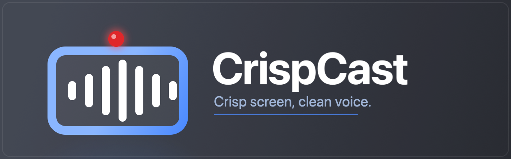
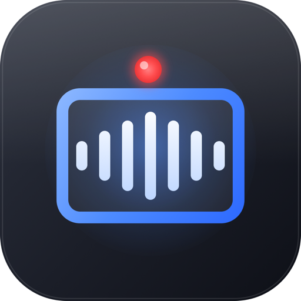

<p align="center">
  <a href="LICENSE"></a>
  
  
  <a href="https://github.com/codewithowais/CrispCast/releases/latest"></a>
</p>

# CrispCast

A cross-platform desktop screen recorder that captures your screen in high
resolution along with system audio and an **isolated, raw microphone track** —
then denoises the voice and merges everything into a single clean H.264 MP4.

> **Crisp screen, clean voice.**

## Download

Grab a prebuilt installer from the
**[Releases page](https://github.com/codewithowais/CrispCast/releases/latest)**:

| Platform | File |
|----------|------|
| macOS | `.dmg` |
| Windows | `.exe` |
| Linux | `.AppImage` / `.deb` |

> **Heads-up: builds are currently unsigned.** macOS Gatekeeper and Windows
> SmartScreen will warn on first launch. To open anyway:
> - **macOS** — right-click (or Control-click) the app and choose **Open**, then
>   confirm. On newer macOS you may also need System Settings → Privacy &
>   Security → **Open Anyway**.
> - **Windows** — click **More info** on the SmartScreen prompt, then **Run
>   anyway**.

Prefer to build it yourself? See [Build from source](#build-from-source).

## Features

- **High-resolution screen video** captured at the source's native resolution.
- **System-audio loopback** — records the actual computer output, not just the mic.
- **Isolated raw microphone track** saved separately, with no noise suppression,
  gain, or echo cancellation applied.
- **One-click voice cleanup + merge** — auto-denoise the voice and mix it back
  with the system audio into a single **H.264/AAC MP4** that plays everywhere.
- **Optional compression** to 1080p or 720p for smaller shareable files.
- **Choose your save folder** any time from the in-app *Save to → Change…* bar.
- **Fully offline** — all audio processing runs locally through a bundled
  `ffmpeg` (`ffmpeg-static`). No cloud, no account, no model download.

### How the recording is structured

Each recording keeps the voice on its own track so it's easy to denoise, then
remux back onto the video:

| File | Contents |
|------|----------|
| `recording-<timestamp>.webm` | Screen video (native resolution) + system audio |
| `recording-<timestamp>-voice.webm` | Your microphone, **raw** |
| `recording-<timestamp>-clean.mp4` | *(after "Clean voice → MP4")* final H.264/AAC video with the denoised voice mixed in |

The offline denoise chain is a straightforward ffmpeg filter — remove rumble,
hiss and AC noise, then normalize loudness:

```
highpass=f=80,afftdn,anlmdn,loudnorm
```

The original raw `.webm` files are always kept, so you can re-clean with
different settings later.

## Preview

<p align="center">
  
</p>


<!--
  Maintainers: drop a real in-app screenshot here (e.g. assets/screenshot.png)
  and reference it with:  
-->

## Build from source

```bash
npm install
npm start
```

That's it to run the app in development. For building distributable installers
and the full per-OS story (macOS Screen Recording permission, Windows WASAPI
loopback, Linux X11/Wayland + PipeWire caveats, and ffmpeg packaging notes), see
**[CROSS_PLATFORM.md](CROSS_PLATFORM.md)**.

## Contributing

Contributions are welcome! See **[CONTRIBUTING.md](CONTRIBUTING.md)** for how to
set up, the project layout, running the self-test (`electron . --selftest`), and
how to open issues and pull requests.

## License

Released under the [MIT License](LICENSE). © 2026 codewithowais.
